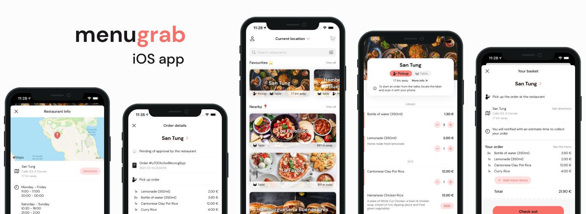

# Menugrab

## Overview

Menugrab is a __working prototype__ platform to order food from restaurants.

It features an __iOS app__ with a list of restaurants that users can make orders from and a __web app__ ([menugrab-webapp](https://github.com/guillevc/menugrab-webapp)) for restaurant management. Both apps feed from a single __backend service__ ([menugrab-server](https://github.com/guillevc/mengurab-server)).

### Features

For clients:

- _Pickup orders_: Browse nearby restaurants and make an order that should be picked up at the restaurant when completed.
- _Table orders_: Scan the identifier located in the restaurant table (e.g. NFC tag or QR label). The restaurant menu will be opened in the app and a _table order_ will start. When completed, it should be delivered to the table by the restaurant staff. This feature is available through an [App Clip experience](https://developer.apple.com/app-clips/), so it can be used without the need of installing the full app.
- Browse restaurants by location
- PUSH notifications about order state changes.
- Estimated time of completion of every order.

For restaurants:

- Order states: `pending`, `accepted`, `completed` and `canceled`.
- Visual summary of recent orders based on their state.
- Fast transition between order states.
- Send user PUSH notifications automatically on order state changes.
- An order must have an estimated time of completion associated before advancing to `pending` state.

### Repositories

The platform implementation consists on the projects contained in the following repositories:

- [menugrab-ios](https://github.com/guillevc/menugrab-ios)
- [menugrab-webapp](https://github.com/guillevc/menugrab-webapp)
- [menugrab-server](https://github.com/guillevc/menugrab-server)

## iOS App

This repository contains the source code of the iPhone app component of Menugrab.

It' built completely using SwiftUI and Combine, reducing to almost zero the use of callbacks and delegates. It relies on Firebase Authentication for user login and in Firebase Cloud Messaging for receiving notifications from the backend server.

### UI/UX design

Overall, it consisted on the following steps:

- Research and high level analysis. Definition of user stories.
- UX design (concrete functionalities and user flows)
- Wireframes: <https://www.figma.com/file/hKtCUhLgBMmh2IZvE6JENS/Wireframe>
- Selection of color palette and fonts
- Definitive designs: <https://www.figma.com/file/zHZoGCuCigH3fqq0QYCMPL/Design-v2>

### Architecture

It's based off of [Alexey Naumov](https://github.com/nalexn)'s [Clean Architecture for SwiftUI](https://nalexn.github.io/clean-architecture-swiftui/?utm_source=nalexn_github) article and his MVVM version implementation ([clean-architecture-swiftui](https://github.com/nalexn/clean-architecture-swiftui/tree/mvvm)).

### Requirements

- Xcode 10.15+
- iOS 14+
- Firebase projects for Firebase Authentication.

### Quick start

- Add your `GoogleService-Info.plist` files to `Menugrab` and `MenugrabAppClip` folders.
- Point to a running [menugrab-server](https://github.com/guillevc/menugrab-server) instance in `AppEnvironment.swift` with populated restaurant data or use the default sample instance `https://menugrab.herokuapp.com/docs`
